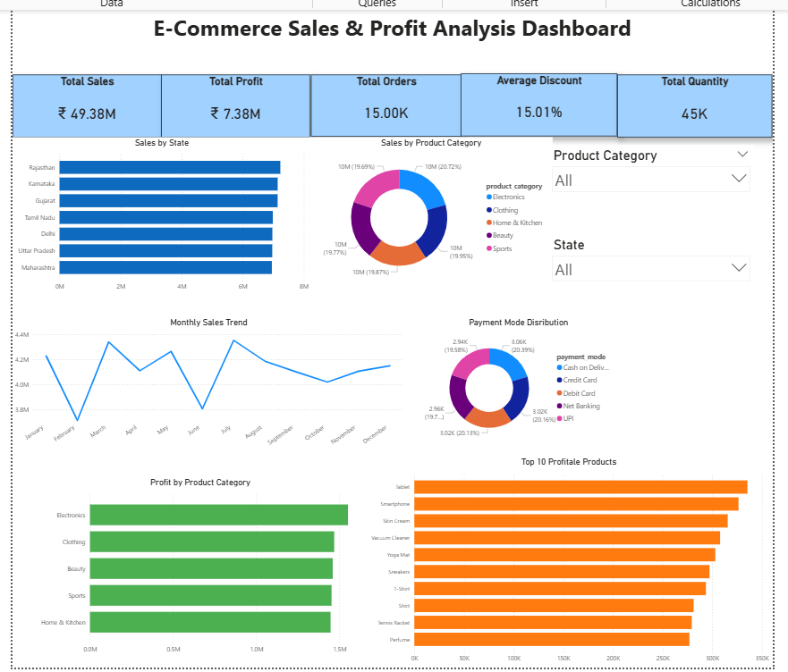

# E-Commerce Sales & Profit Analysis Dashboard

## Project Overview
This project analyzes e-commerce sales data using SQL and Power BI to identify sales trends, profitable products, customer purchasing behavior, and business performance.

## Tools Used
- SQL
- Power BI
- Excel

## Key KPIs
- Total Sales: ₹49.38M
- Total Profit: ₹7.38M
- Total Orders: 15,000
- Average Discount: 15.01%
- Total Quantity Sold: 45,000

## Dashboard Preview

## Key Insights

- Rajasthan generated the highest sales.
- Electronics was the highest-performing category.
- Sales peaked during March and July.
- Payment methods were distributed evenly.
- Tablets and Smartphones were among the most profitable products.

## Project Files

- Power BI Dashboard (.pbix)
- SQL Queries
- Dataset
- Project Report
